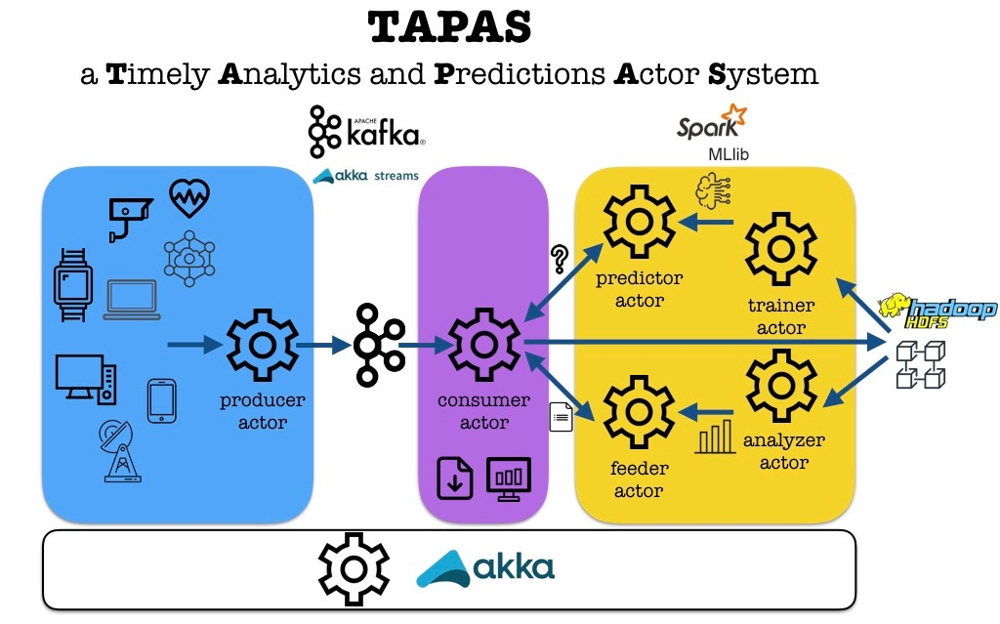

# TAPAS - Timely Analytics and Predictions Actor System


## Overview
TAPAS is a framework to execute machine learning and data analytics tasks supported by actor model and in a timely fashion.
Based on Akka toolkit following actor model, implemented by Scala programming language, it adopts Apache Spark to compute parallel distributed analysis and Spark MLlib to build and execute regression and classification models, Apache Kafka to decouple the layers of producer and consumer, HDFS for distributed stored and processing of big data.


## Installation
* pull-down github repository

```shell
git clone https://github.com/faro1976/utiu.git
```

* go to TAPAS home folder

```shell
cd thesis/TAPAS
```

* build executable (thanks to maven)
```shell
mvn clean package
``` 

* run btc-poller  - only for btc case study
```shell
bin/start-btc-poller
``` 


## Start all external framework daemons
execute
```shell
bin/start-all.sh
```
in order to start:
* Apache ZooKeeper - distributed coordinator
* Apache Kafka - message broker
* Apache HDFS - distributed file system
* Apache Spark - distributed parallel computing

create kafka topic with command
```shell
bin/kafka-topics.sh --create --bootstrap-server localhost:9092 --replication-factor 1 --partitions 1 --topic [{btc,activity}]
```

create directory and load input data into HDFS
```shell
bin/hadoop dfs -mkdir /[{btc,activity}]
bin/hadoop put -put [intpu_path] /[{btc,activity}]
```

## Application pipeline
The TAPAS bootstrap starts actors trainer, consumer (passing predictor and feeder), producer and analyzer.

The trainer starts every X minutes the building of a set of machine learning models and at the finishing notifies the predictor transferring the ML model just built dinamically choosing the fittest model between regression/classification Spark algorithm implementations, it saves the evaluation metrics for the regression/classification algorithms adopted and stores metrics into rt/[case_study]/output/[case_study]-[{regression,classification}]-eval.csv.

The analyzer starts every Y minutes a new data analytics computation and at the finishing notifies feeder transferring the statistical data just computed .  

Every Z minutes the btc-poller reads data from Blockchair REST API and writes data to a file into the local file system rt/[case_study]/input/.

The producer notices the file changed by a file system watcher and puts a message input to a kafka topic.

The consumer extracts input message from the kafka topic and depending on the input type it routes to predictor and/or feeder.

The predictor receives the input message and computes prediction using a fresh model built from trainer and returns the predicted value to the consumer.

The consumer reads prediction and stores it to rt/[case_study]/output/[case_study]-prediction.csv.

The feeder returns the fresh data analytics obtained from analyzer.

The consumer reads data analytics and stores it to rt/[case_study]/output/[case_study]-stats.csv.


## Case studies

* Bitcoin statistics and prediction

Bitcoin price prediction and general statistics about Blockchain and Bitcoin network: regression techniques to predict Bitcoin price observing a set of features inside Blockchain and Bitcoin peer-to-peer network, adopting time window to predict the average price of Bitcoin in the next hour.
Dataset retrieved from regular polling of Blockchair REST APIs (https://github.com/Blockchair/Blockchair.Support/blob/master/API.md).

* Activity recognition

Activity recognition of older people by wearable sensors (classification, 4 classes): classification of older people motion data to detect motion labels: sitting on bed, sitting on chair, lying on bed, ambulating. 
Dataset from https://archive.ics.uci.edu/ml/datasets/Activity+recognition+with+healthy+older+people+using+a+batteryless+wearable+sensor 

* Wine (debug only)

Wine cultivars classification based on a chemical analysis (classification, 13 features, 3 classes).
Dataset from https://archive.ics.uci.edu/ml/datasets/Wine


## TAPAS Execution
To run TAPAS with a case study:

* case study Bitcoin

```shell
java -Dconfig.file=cfg/application.conf -cp target/TAPAS-0.0.1-SNAPSHOT-jar-with-dependencies.jar it.utiu.tapas.Runner btc
``` 

* case study Activity recognition

```shell
java -Dconfig.file=cfg/application.conf -cp target/TAPAS-0.0.1-SNAPSHOT-jar-with-dependencies.jar it.utiu.tapas.Runner activity
``` 


## Pipeline
The solution is composed of the following phases [components]:
* ingestion [producer]: collects the raw data files and sends its by message to relative topic of a message broker;
* routing [consumer]: reads the data from topic and dispatches the message to the suitable component, choosing action between save into a distributed file system if the message is a data input and forward request to predictor if the messagge is a prediction request; 
* ml training [trainer]: executes a ml training phase reading raw data from a distributed file system, builds a ml model and notifies its predictor transferring to it the fresh model just computed;
* prediction [predictor]: receives a prediction request and replies to it applying a suitable ml model and making a prediction;
* analysis [analyzer]: computes statistics on the raw data from a distributed file system and notifies its predictor transferring to it the fresh stastistic data.


## Abstract implementation
The it.utiu.tapas.base package contains abstraction level of TAPAS:
* AbstractBaseActor: shared constants, defines supervisor strategy, provides file writing function.
* AbstractTrainerActor: starts a Spark training session, handles StartTraining and TrainingFinished messages, invokes ml model building, selects fittest model by metrics, notifies predictors passing the fresh model.
* AbstractRegressionTrainerActor: implements the fittest regression model algo, logic to build a correlation matrix.
* AbstractClassificationTrainerActor: implements the fittest classification model algo, logic to build a confusion matrix.
* AbstractPredictorActor: starts a Spark prediction session, handles AskPrediction and TellPrediction messages, invokes specific prediction function.
* AbstractConsumerActor: starts a Kafka consuming session, receives message from topic and dispatches to predictor and/or save data input when reaches the buffer size limit.
* AbstractProducerActor: starts a Kafka producing session, listens on input files path and sends new data to topic.
* AbstractAnalyzerActor: starts a Spark analyzing session, handles StartAnalysis and AnalysisFinished messages, invokes specific analysis function and at the finishing save result into a csv file.
* AbstractStatsFeederActor: handles AskStats and TellStats messages, receives from analyzer fresh statistical data and when sollicited return its.



